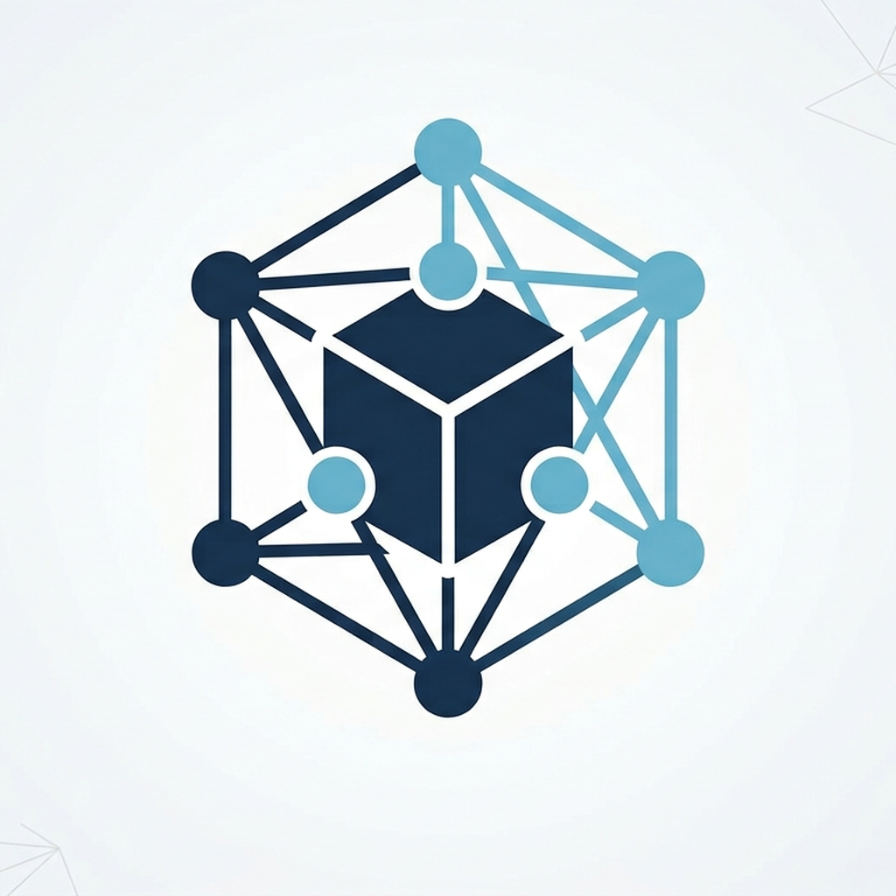

<div align="center">



# NODARIS

**Monitoramento de rede simples, resiliente e centralizado.**

</div>

## Arquitetura

- **NODARIS Core**: API FastAPI, `MonitorEngine`, máquina de estados e persistência.
- **NODARIS Admin**: cliente PySide6 para dashboard, detalhes e CRUD de equipamentos.
- **NODARIS TV**: wallboard PySide6 independente e somente leitura.
- **NODARIS Watchdog**: valida `/health` e recupera o Core quando existe falha persistente.
- **SQLite**: histórico de probes, eventos, incidentes e último estado conhecido.
- **NativePingClient**: probes ICMP pelo `ping.exe` nativo do Windows.

Admin e TV nunca iniciam nem encerram o Core. Ambos são clientes da API local em `http://127.0.0.1:8765`.

## Estados

O Core consolida probes em `ONLINE`, `SUSPECT`, `OFFLINE` e `RECOVERING`. Equipamentos em manutenção permanecem no catálogo administrativo, mas não participam do ciclo de probe. O contrato atual confirma `OFFLINE` após três falhas consecutivas e recuperação após dois sucessos consecutivos.

Erros técnicos do mecanismo de monitoramento são classificados como `ERROR` e não contam automaticamente como queda real do equipamento.

## Dados persistentes

No Windows existe uma única fonte de verdade, usada tanto pelo source quanto pelos executáveis instalados:

```text
%ProgramData%\NODARIS\
├── config\ips.json
├── data\monitor_api.db
├── data\monitorping_watchdog_state.json
└── logs\
    ├── monitorping-core.log
    ├── monitorping-engine.log
    ├── monitorping-watchdog.log
    └── monitorping-error.log
```

Isso evita que uma execução em source monitore um `ips.json` diferente daquele usado pela instalação.

Para testes isolados, defina `NODARIS_DATA_ROOT` antes de iniciar qualquer componente:

```powershell
$env:NODARIS_DATA_ROOT = "$env:TEMP\NODARIS-test"
```

Remova a variável para voltar ao armazenamento operacional:

```powershell
Remove-Item Env:NODARIS_DATA_ROOT -ErrorAction SilentlyContinue
```

O instalador e o uninstall não apagam `%ProgramData%\NODARIS`; configuração e histórico são preservados em atualização/reinstalação.

## Desenvolvimento no Windows

Requisitos: Windows 10/11 x64 e Python compatível com `requirements.txt`.

```powershell
py -m venv .venv
.\.venv\Scripts\python.exe -m pip install --upgrade pip
.\.venv\Scripts\python.exe -m pip install -r requirements-build.txt
```

### Testes

```powershell
$env:QT_QPA_PLATFORM = "offscreen"
.\.venv\Scripts\python.exe -m unittest discover -s tests -v
Remove-Item Env:QT_QPA_PLATFORM -ErrorAction SilentlyContinue

.\.venv\Scripts\python.exe -m compileall api core desktop -q
```

### Execução em source

Pare primeiro qualquer Core instalado que esteja ocupando a porta `8765`.

Core:

```powershell
.\.venv\Scripts\python.exe -u -m core.main
```

Admin, em outro terminal:

```powershell
.\.venv\Scripts\python.exe -u -m desktop.main
```

TV em janela:

```powershell
.\.venv\Scripts\python.exe -u -m desktop.tv_main --windowed
```

Health check:

```powershell
Invoke-RestMethod http://127.0.0.1:8765/health | Format-List
```

Status:

```powershell
$status = Invoke-RestMethod http://127.0.0.1:8765/api/v1/status
$status.summary
$status.engine_metrics
```

Catálogo:

```powershell
Invoke-RestMethod http://127.0.0.1:8765/api/v1/devices | ConvertTo-Json -Depth 10
```

## Watchdog

O Watchdog diferencia indisponibilidade real de timeout HTTP transitório. Um Core ainda identificado como vivo não é substituído imediatamente por causa de uma única demora em `/health`.

Validação manual:

```powershell
.\.venv\Scripts\python.exe -m core.watchdog
```

Na instalação oficial ele é executado periodicamente pela tarefa `NODARIS Watchdog`.

## Build

Gere os três aplicativos separadamente:

```powershell
.\.venv\Scripts\python.exe -m PyInstaller --noconfirm --clean .\NODARIS-Core.spec
.\.venv\Scripts\python.exe -m PyInstaller --noconfirm --clean .\NODARIS-Admin.spec
.\.venv\Scripts\python.exe -m PyInstaller --noconfirm --clean .\NODARIS-TV.spec
```

Valide os artefatos:

```powershell
.\.venv\Scripts\python.exe .\scripts\verify_build.py
```

Compile `NODARIS.iss` com Inno Setup 6 somente depois de testes, `compileall` e `verify_build.py` passarem.

## CI

O workflow `NODARIS CI` executa em Windows:

- instalação das dependências;
- `pip check`;
- suíte `unittest`;
- `compileall`;
- builds PyInstaller de Core, Admin e TV;
- `scripts/verify_build.py`.

## Desenvolvedores

- **DragonBlack18** — Desenvolvimento de Software e evolução do sistema.
- **JEFERSON BRANGER** — Infraestrutura e suporte de infraestrutura.

## Compatibilidade

Alguns identificadores internos continuam com o nome histórico `monitorping` para preservar contratos de logs, banco e clientes existentes. Eles não são marca visível e não devem ser renomeados sem migração específica. Consulte `docs/REBRANDING.md` e `docs/DATA_RETENTION.md`.
